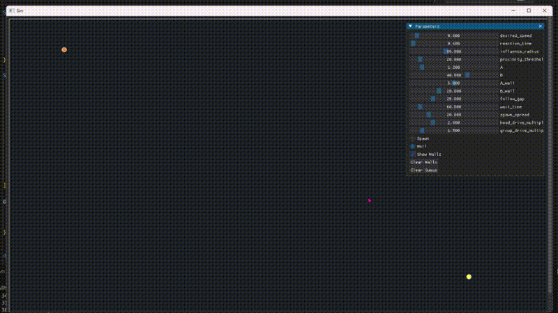

# RSSI Simulator

A pedestrian-dynamics simulator for generating labelled training data that distinguishes **dining hall queue traffic** from **general room occupancy**. Real BLE/RSSI sensors observe device presence but cannot, on their own, separate people waiting in a serving line from people merely occupying a space. This simulator produces synthetic agent trajectories — and, in due course, the corresponding RSSI signatures — under controllable conditions, providing ground-truth labels that supervised models can be trained and evaluated against.

Rendering and interactive control are provided by [Dear PyGui](https://github.com/hoffstadt/dearpygui).



## Setup

```
uv sync
uv run main.py
```

## Usage

The interface presents a simulation canvas alongside a parameter panel. Two interaction tools are selectable via the radio control:

- **Spawn** — clicking the canvas spawns a *group* of agents (size drawn from a right-skewed distribution) clustered around the click location.
- **Wall** — two successive clicks define a wall segment. Walls exert repulsive forces and are used to construct corridors that constrain queue geometry.

All force parameters are exposed as live sliders; changes take effect immediately, without restarting the simulation. The `Clear Walls` and `Clear Queue` buttons reset the corresponding state.

## Model

Agent motion follows a simplified variant of the [Social Force Model](https://pedestriandynamics.org/models/social_force_model/) (Helbing & Molnár). Each agent is a point mass carrying position, velocity, a fixed radius, and a group identifier. On every frame, the net force on each agent is computed from the current configuration, accumulated into its velocity, and integrated to update its position. 

### Driving force

Each agent is steered toward a target point at a desired speed $v_0$, with the term in the current velocity $\vec{v}$ providing intrinsic damping over a characteristic reaction time $\tau$:

$$\vec{F}_\text{drive} = \mu \frac{v_0\hat{e} - \vec{v}}{\tau}$$

Here $\hat{e}$ is the unit vector from the agent to its target and $\mu$ is a role-dependent multiplier: the queue head and trailing-group members receive elevated values ($\mu_\text{head}$, $\mu_\text{group}$) so that the front of the line advances decisively and groups track one another without stalling. Lower $\tau$ yields more responsive acceleration; excessively high $\tau$ attenuates the force and stalls movement.

### Agent repulsion

Agents resist crowding through a short-range exponential repulsion summed over all neighbours within a cutoff radius $R$:

$$\vec{F}_\text{rep} = \sum_{j \neq i} A \cdot \exp\left(\frac{r_i + r_j - d_{ij}}{B}\right) \hat{n}_{ij}$$

where $d_{ij}$ is the inter-agent distance, $r_i + r_j$ the sum of their radii, and $\hat{n}_{ij}$ the unit vector pointing from neighbour $j$ to agent $i$ (i.e. the direction of the push away from the neighbour). The amplitude $A$ scales overall strength; the falloff length $B$ controls how sharply the force decays with separation. 

### Wall repulsion

Each wall is a finite line segment that repels nearby agents using the same exponential law, sourced from the point on the segment closest to the agent. The closest point is found by projecting the agent onto the segment's supporting line and clamping the projection parameter $t$ to $[0, 1]$:

$$t = \mathrm{clamp}\left(\frac{(\vec{q} - \vec{p}_1) \cdot \vec{d}}{\lVert \vec{d} \rVert^2}; 0; 1\right), \qquad \vec{c} = \vec{p}_1 + t\,\vec{d}$$

with $\vec{p}_1, \vec{p}_2$ the segment endpoints, $\vec{d} = \vec{p}_2 - \vec{p}_1$, and $\vec{q}$ the agent position. The repulsion then acts along $\hat{n} = (\vec{q} - \vec{c}) / \lVert \vec{q} - \vec{c} \rVert$:

$$\vec{F}_\text{wall} = \sum_\text{walls} A_w \cdot \exp\left(\frac{r_i - d}{B_w}\right) \hat{n}, \qquad d = \lVert \vec{q} - \vec{c} \rVert$$

The force is perpendicular to the wall when the agent lies alongside it, and radial from an endpoint when the agent is beyond the segment's extent. Wall constants ($A_w$, $B_w$) are tuned independently of agent repulsion, typically stronger, so that corridors reliably contain the queue.

### Integration

Forces are combined and integrated explicitly with unit time step:

$$\vec{v} \leftarrow \vec{v} + \vec{F}_\text{drive} + \vec{F}_\text{wall} + \frac{\vec{F}_\text{rep}}{m}, \qquad \vec{x} \leftarrow \vec{x} + \vec{v}$$

## Queue and group structure

The queue is an ordered list of groups; each group is a set of agents sharing a group identifier (intended to model parties arriving together, which in turn produce correlated RSSI signatures). Targeting is assigned hierarchically:

- The **head** of the front group — defined as the agent physically nearest the goal, not by list order — drives directly at the end point and brakes on arrival, dwelling for a fixed service interval before removal.
- **Remaining members of the front group** follow the agent ahead of them, targeting a standoff point offset one `follow_gap` upstream along the queue axis, so that followers settle into line rather than converging on a single point.
- **Trailing groups** follow the mean position of the group immediately ahead, similarly offset, so that groups track one another as cohesive units while internal spacing is maintained by repulsion.

Serving proceeds one agent at a time from the front of the leading group; when a group is exhausted it is removed and the next group advances.
